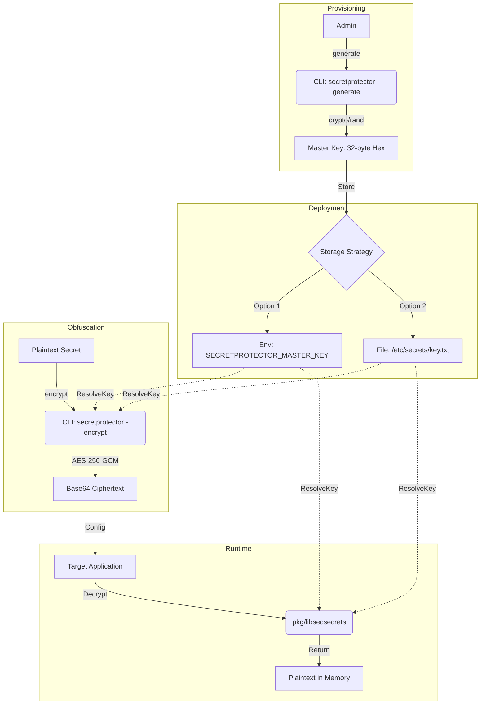
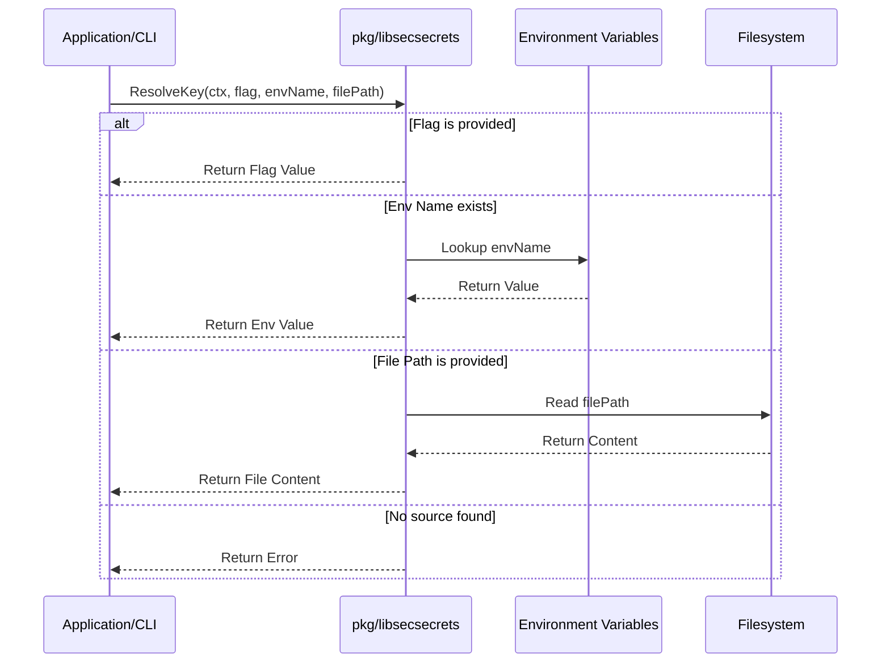

# Architecture & Design: SecretProtector

This document outlines the architectural decisions, design patterns,  data flow, control logic and dependencies for the SecretProtector system.

## 1. System Overview

SecretProtector is a professional-grade secret management system designed to eliminate the storage of plaintext passwords on disk or in version control. It consists of three primary layers (using an SFTP client as a common example):
1.  **Core Library (`pkg/libsecsecrets`):** The cryptographic engine.
2.  **CLI Tool (`cmd/secretprotector`):** The administrative interface for key and secret management.
3.  **Application Layer:** Integration via a "Bootstrap" sequence for runtime decryption.

## 2. Architecture & Design Choices

### 2.1 Cryptographic Standard
- **AES-256-GCM (Galois/Counter Mode):** Chosen for authenticated encryption. It provides both confidentiality and integrity, ensuring that any tampering with the ciphertext or nonce will be detected during decryption.
- **Randomness:** Uses `crypto/rand` for cryptographically secure pseudo-random number generation (CSPRNG) for both 32-byte keys and GCM nonces.
- **Memory Security (Zeroing):** All sensitive buffers (Master Keys, Plaintext) are explicitly zeroed out after use using the `ZeroBuffer` utility to minimize the window of exposure in memory.

### 2.2 Package Structure
The project uses a standard Go layout:

```text
secretprotector
├── cmd/
│   └── secretprotector/
│       ├── main.go           # CLI Tool
│       └── main_test.go      # Integration tests
├── pkg/
│   └── libsecsecrets/
│       ├── libsecsecrets.go  # Core Logic
│       └── libsecsecrets_test.go # Unit tests
├── ARCHITECTURE.md           # Technical design
├── DESIGN.md                 # Specification
├── README.md                 # User guide
├── SAMPLEAPP.md              # Developer integration guide
├── TESTING.md                # Test suite & coverage
└── go.mod
```

- `pkg/`: Internal library code that can be imported by other projects.
- `cmd/`: Entry points for executables.
- **Single Module:** All components reside in `criticalsys/secretprotector` to ensure atomic updates and simplified dependency management.

### 2.3 Key Resolution Strategy
The system implements a hierarchical precedence model for Master Key resolution:
1.  **Direct Input (Flag):** Highest priority for temporary overrides or testing. Supports 64-character hex or 32-byte raw strings.
2.  **Environment Variable:** Standard for CI/CD pipelines and containerized environments. Supports 64-character hex or 32-byte raw strings.
3.  **File Path:** Standard for on-premise deployments or hardware-backed secrets. Supports 64-character hex or 32-byte raw strings.

### 2.4 Platform Security Boundaries
- **Linux/Unix:** Enforces `0400` (Read-Only Owner) or `0600` (Read-Write Owner) permissions on key files to prevent unauthorized local access.
- **Windows:** Implements "Insecure Location" detection, preventing the use of master keys stored in shared or volatile directories like `Public` or `\temp\`.

### 2.5 Resource Management & Performance
- **Sync Pool Optimization:** The library utilizes `sync.Pool` for managing sensitive byte slices (e.g., during key generation). This reduces garbage collection (GC) overhead and ensures that buffers are securely zeroed before being returned to the pool.
- **Context Propagation:** All primary API functions (`ResolveKey`, `Encrypt`, `Decrypt`) accept `context.Context`, allowing for cancellation support and better integration with modern Go application lifecycles.
- **Custom Error Architecture:** Instead of generic errors, the system uses a structured set of exported error types (e.g., `ErrInvalidKey`, `ErrInsecureLocation`) to allow for predictable programmatic error handling by consumers.

## 3. Operational Workflow

1.  **Provisioning:** Admin runs `secretprotector -generate` to create a Master Key.
2.  **Deployment:** The Master Key is stored in an environment variable or a protected file.
3.  **Obfuscation:** Secrets (such as SFTP passwords, API keys, or DB credentials) are encrypted using the CLI and stored in configuration files as Base64 strings.
4.  **Runtime:** The application resolves the Master Key at startup, decrypts the secret into memory, and proceeds with the operation without ever writing the plaintext to disk.

## 4. Data Flow & Control Logic

### 4.1 Operational Flow (Mermaid)
The following diagram illustrates the lifecycle of a secret, from master key generation to runtime decryption.



### 4.2 Key Resolution Sequence
The `ResolveKey` function implements the following priority logic:



## 5. Dependencies

### 5.1 Standard Library
The implementation relies exclusively on the Go standard library to minimize the attack surface and ensure maximum portability:
- `crypto/aes`, `crypto/cipher`: For encryption/decryption logic.
- `crypto/rand`: For secure random data.
- `encoding/hex`, `encoding/base64`: For data serialization.
- `os`, `flag`: For CLI interactions and system integration.

### 5.2 External Dependencies
None. This project is intentionally designed with **Zero External Dependencies** to facilitate security audits and prevent supply-chain vulnerabilities.
